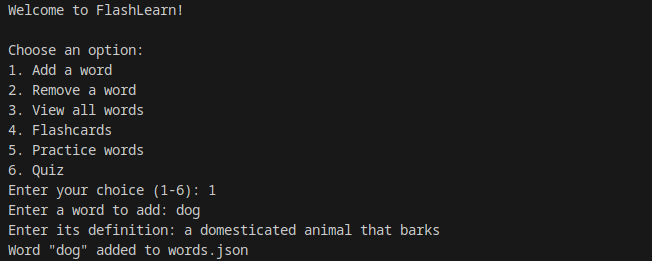
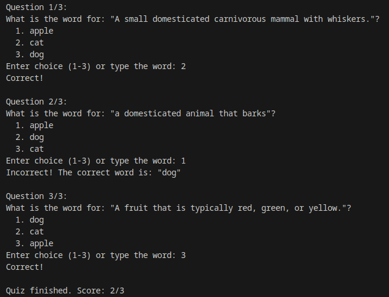
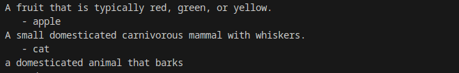
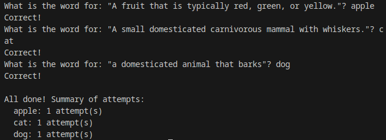

# Flash-Learn
Flash-Learn is a command-line application designed to help you learn and practice vocabulary words through flashcards, practice sessions, and quizzes.

# Word Management
- **Add Words**: add new words with their definitions
- **Remove Words**: Delete words you no longer want to practice
- **View All Words**: Browse through your complete vocabulary list

# Learning Modes
- **Flashcards**: See the definition and try to recall the word
- **Practice Words**: Write words based on hat repeats words you get wrong until you master them
- **Quiz Mode**: Multiple-choice quizzes with automatic scoring (new!)

  
   
### Quiz
  
  
### Flashcards

## Practice
